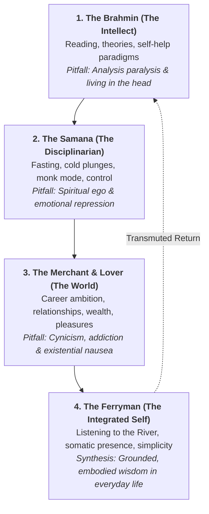

# The Modern Siddhartha: A Grounded Guide to Consciousness & Self-Mastery

> *"Wisdom is not expressible in words... Knowledge can be communicated, but not wisdom. One can find it, live it, be fortified by it, do wonders through it, but one cannot express and teach it."*  
> — Hermann Hesse, *Siddhartha*

---

## Prologue: The Dilemma of the Modern Seeker

In Herman Hesse’s *Siddhartha*, the young seeker discovers that no dogma, guru, or intellectual discipline can give him what he seeks. He must walk through the Brahmin’s knowledge, the Samana’s asceticism, the merchant’s desires and worldly pursuits, the river’s quiet wisdom, and the ferryman’s humble presence.

In today's world, our challenge is distinct yet identical:
- **We drown in information but starve for wisdom.** Podcasts, books, biohacks, and philosophies overload our intellect.
- **We live entirely in our heads.** The screen pulls our consciousness upward and outward, detaching us from our nervous system and the earth beneath our feet.
- **We oscillate between extreme discipline and sensory overwhelm.** We swing from 75-day challenges and dopamine detoxes straight into algorithmic doomscrolling and burnout.

To explore your consciousness like Siddhartha in the modern world is not to escape to a cave or renounce society. It is to walk through the modern marketplace with an unshakeable inner river, rooted in the body and clear in the mind.

---

## I. The Four Iterations of the Journey

Your path of self-improvement is not linear; it is an integrative cycle.

1. **The Brahmin (The Head):** You study psychology, philosophy, productivity, and spiritual traditions. You understand the theories of life, yet you feel that understanding is not the same as transformation.
2. **The Samana (The Will):** You apply rigorous discipline—dopamine fasting, workout splits, strict diets, meditation streaks. You test your limits. But discipline alone can become a refined cage of self-judgment.
3. **The Worldly Merchant (The Senses & Ambition):** You dive into work, money, romance, status, and worldly challenges. You taste both success and disappointment. You realize that outward milestones cannot soothe the inner longing.
4. **The Ferryman by the River (Grounded Integration):** You cease fleeing. You plant your feet in the mud. You learn to listen—to your body, to reality as it is, and to the continuous flow of life without trying to dam it up.

---

## II. The Three Modern Superpowers

When Siddhartha was asked by the merchant Kamaswami what skills he brought to the marketplace, he replied:

$$\text{"I can think. I can wait. I can fast."}$$

In the 21st century, these three ancient arts are the ultimate competitive and spiritual advantages.

### 1. "I Can Think" (Discerning Signal from Algorithmic Noise)
- **Modern Reality:** Most "thinking" is merely reacting to other people's opinions, algorithms, and feeds.
- **The Practice:** First-principles thinking and meta-cognition.
  - Ask: *"Is this thought mine, or was it planted by an algorithm or social conditioning?"*
  - Daily journaling with an analog pen: Unpack emotional knots before making major decisions.
  - Distinguish between **problem-solving** (constructive) and **rumination** (friction without movement).

### 2. "I Can Wait" (Boredom Tolerance & Emotional Poise)
- **Modern Reality:** The modern nervous system expects sub-second gratification—streaming, delivery, instant replies. Impatience is the root of modern anxiety.
- **The Practice:** Reclaiming the space between stimulus and response.
  - Tolerate empty moments: Stand in queues, sit at red lights, or walk without headphones.
  - Allow decisions and emotions to simmer for 24–48 hours before reacting.
  - Trust cyclical timing: Seeds do not grow faster because you pull on the sprouts.

### 3. "I Can Fast" (Informational & Sensory Restraint)
- **Modern Reality:** Continuous hyper-stimulation desensitizes dopamine receptors, making ordinary life feel dull.
- **The Practice:** Selective deprivation to restore reverence for the simple.
  - **Digital Fasting:** First 60 minutes and last 60 minutes of each day screen-free.
  - **Dopamine Reset:** Regular periods of low-stimulation weekends (nature, reading, cooking, walking).
  - **Consumption Fast:** Pause buying items or consuming new books until existing ones are digested and applied.

---

## III. Grounded Consciousness: The Somatic Anchor

Many seekers get lost in "spiritual bypassing"—trying to float above their human reality into abstract enlightenment. Grounded consciousness is the exact opposite: bringing the light of awareness all the way down into the soles of your feet.

> [!IMPORTANT]
> The body is the subconscious mind in physical form. You cannot think your way into a calm nervous system; you must embody it through physiology.

### 1. Somatic Awareness Checkpoints
Throughout the day, run this 30-second scan:
1. **Jaw & Tongue:** Unclench the teeth; soften the tongue from the roof of the mouth.
2. **Shoulders & Chest:** Drop shoulders away from ears; breathe into the belly, expanding the lower ribs 360 degrees.
3. **Pelvis & Feet:** Feel the contact of your feet against the floor or your hips against the chair. Acknowledge gravity supporting you.

### 2. Physical Grounding Practices
- **Barefoot Contact (Earthing / Grounding):** Walk on soil, grass, or sand. Let the tactile feedback recalibrate your sensory system.
- **Vagus Nerve Toning:** Extended exhales (e.g., inhale 4s, exhale 7s), cold water face immersion, humming or singing.
- **Heavy Sensory Input:** Resistance training, carrying weight, or working with physical materials (wood, stone, cooking from scratch). Physical effort pulls energy down from an overactive head.

---

## IV. The River in the Digital Age: The Art of Listening

In the final chapter of Hesse's novel, Siddhartha sits with Vasudeva by the river. The river teaches them:
1. **Time is an illusion:** The river is everywhere at once—at the spring, at the waterfall, at the sea, in the clouds.
2. **Every voice belongs:** In the river's sound are all sounds—the voice of joy, sorrow, anger, birth, and death. Together, they form the single word: *Om* (wholeness).

### How to "Listen to the River" Today
- **Listen without interrupting or preparing a rebuttal:** In conversation, gift others your complete, unbroken presence. Notice how rare and transformative this is.
- **Observe emotions like weather over the river:** You are not your anxiety; anxiety is an eddy in the current passing through your awareness.
- **Embrace your own contradictions:** Stop demanding that you be a monolithic, perfect version of yourself. You are both the student and the teacher, the saint and the sinner, the ambitious builder and the quiet observer.

---

## V. The Daily Blueprint: A Grounded Day

| Phase | Pillar | Practice | Intention |
| :--- | :--- | :--- | :--- |
| **Morning** *(The Dawn)* | Grounding & Centering | • Hydrate & step into natural light • 10 min quiet stillness / breath • No screens for the first hour | Establish your center before the world demands your attention. |
| **Midday** *(The Marketplace)* | "I can think & wait" | • Single-task deep focus blocks (90 min) • Somatic check-in before meals • Walk outside between work sprints | Engage fully in worldly responsibilities without being consumed by them. |
| **Evening** *(The Riverbank)* | Integration & Rest | • Analog winding down (reading, writing) • Gratitude & release of the day's events • Cool, dark, quiet sleep sanctuary | Let the day's waters settle. Return to the breath and the earth. |

---

## VI. The Guiding Credo

> [!TIP]
> Keep this compass near you when you feel untethered:
> 1. **Do not seek an escape from reality.** Seek deeper intimacy with reality.
> 2. **When the mind is stormy, return to the feet.**
> 3. **Honor your worldly ambition, but hold it lightly.** Play the game of life wholeheartedly, knowing it is a divine play (*Lila*).
> 4. **Compare your journey to no one.** Siddhartha had to walk through every mistake to find his peace. Trust your own winding river.
